title: 
Software Architecture of Local Guide by Deepansha Chowdhary
---
 

# Ex - Domain Selection 

{

Domain Description:

```
For [target customers] 
Who [need/opportunity/problem]
The [name your project]
Is  [type of project]
That [major features, core benefits, compelling reason to buy]
Unlike [current reality or competitors]
Our Project [summarize main advantages over status quo, unique selling point]
```

}

Project Name: *Local Guide*

Project Type:

Vision Statement:

For [target customers] Youth, people under 30 years, essentially newcomers who are planning to shift to Lugano

Who [need/opportunity/problem]

Google maps exists, but it exhibits a very global outlook on everything. You might see a lot of supermarkets in the search list, but what about the cheapest one? Or the one with the best quality? Results are vast, but often not very  precise. Not only that, Google searches can get messy, require a lot of memory retention on users part, for someone who has never set foot in foregin land - settling down can become a nightmare. Having observing students on various groups and forums, despite the vast amount of info available on the internet, many people remain clueless about the most basic needs, which in fact are the most important ones. For that purpose,such apps are the need of the hour, as the summarize the exact information an individual may require.

The Local Guide

Is  [type of project] a mobile application

That [major features, core benefits, compelling reason to buy]

Features:
* Distinct categories for each necessity, : transportation, clothes, furniture, shopping, medical, financial,work related etc
* Basic info for every category will be listed, most common banks, mobile network providers, waste management rules etc
* All categories have the best option listed for them, and links provided for more additional info
* Language mode so users are able to read at their own comfort
* Filters for every option based on: prices, distance, quality ratings (given by the users)
* Users can compare prices of items between two shops
* Users will be offered incentives, discounts to motivate them to review places visited by them more
* As a future prospect: to add modes in the app, traveler and new settler mode: to help personalize the users experience

Why this app?

Shifting to a new country is a very different experience, something that no one can ever be fully well prepared for - what more could someone yearn for than a curated view of the best options for your basic amenities? Local Guide gets you exactly that - be it anything you want to know, best insurance, best bank to open an account in, cheap shopping options - everything is there in the app. Everyone knows the big names, but what the local shops, that don't turn up in the google search results, that actually keep relevant stuff - is what this app focuses on.

Unlike [current reality or competitors] Google Maps

Our Project [summarize main advantages over status quo, unique selling point]
More localized view of things, considering a students point of view - keeping in mind their budget and all the basic amenities that one needs in a new place. Removes the need to search for multiple things one at a time, all the information is available for you in one single app

Additional Information:

This is a new project I plan on implementing in the future.


# Ex - Architectural Decision Records

## ADR 1 : Implementation of Offline Mode

1. What did you decide?

Database: Realm Database

2. What was the context for your decision?

The main aim of this decision is to find the most beneficial and optimal solution that takes into consideration the functionalities of the Local Guide app. The main requirement that is into focus, is that the data and the user interface of the application should be made available to the user at all times,with or without network connection.

What is the goal you are trying to achieve?

Allow users to access all the UI and information of the app offline.

What are the constraints?

Limitation on a single string's length.

What is the scope of your decision? Does it affect the entire architecture?

The decision impacts the entire architecture as the selection of the database is of prime importance, because it will be the main storage for all the data required for the mobile app.

3. What is the problem you are trying to solve?

How can I give the users the benefit of accessing the information at all times?

4.  Which alternative options did you consider?

* SQLite Database
* CoreData
* Realm Database

5. Which one did you choose?

Realm Database

6. What is the main reason for that?

It fulfills the main purpose of the application, to give users the feature to access all the information even when offline, in scenarios where there is no access to data or Wifi and also it is fully compatible with Java, which will be used to develop the mobile app. 

List the positive consequences (pros) of your decision:

* Essentially designed for offline use as it can handle the unpredictability concerning mobile apps, such as lost connections, devices being shut down at unfavorable timings and so on. As it is offline first, it is always read from and written to the local database and not over the network.
* As this is a local guide app, the most important component will the keeping the UI in sync, realm used live objects which always reference the most up-to-date data on disk when accessed. 
* As it runs on the client devices, storing, accessing and updating the data is simple.

If any, list the negative consequences (cons)

* As Realm offers many features, it consequently requires a bit more effort for implementation.

## ADR 2 : Programming Language

1. What did you decide?

Language: Java

2. What was the context for your decision?

The main purpose of this decision was to find the suitable programming language that will be compatible with the database selected in the previous decision.

What is the goal you are trying to achieve?

Compatibility with database and development of mobile app.

What is the scope of your decision? Does it affect the entire architecture?

The decision applies to the entire project and is of upmost importance.

3. What is the problem you are trying to solve?

How can we find a suitable language that interoperates with the chosen database?

4.  Which alternative options did you consider?

* Kotlin
* Dart
* C++
* Java

5. Which one did you choose?

Java

6. What is the main reason for that?

Java has one of the most intensive support available, which makes it better for the team to develop the application. Plus, as the project requires several other API'S such as geo location services,language translators, database functions, java fulfills the goal.

List the positive consequences (pros) of your decision:

* Versatile to integrate distinctive apps and functions
* Secure environment for design and development
* Has a lot of built in tools and rich set of library.

If any, list the negative consequences (cons)

* Takes longer time to run

## ADR 3 : Monetization Model

1. What did you decide?

Model: Combination of In app purchases and Sponsorship

2. What was the context for your decision?

The purpose to be looked into is how will the app be monetized after its post deployment stage.

What is the scope of your decision? Does it affect the entire architecture?

The scope of this decision extends to the post deployment stage of the application

3. What is the problem you are trying to solve?

What will be the revenue generation strategy of the app?

4.  Which alternative options did you consider?

* In-App Advertising
* Pay to download apps
* Paywalled Content
* Transactions Commissions
* Subscriptions
* In app purchases

5. Which one did you choose?

Combination of the subscription and in app purchases model.

6. What is the main reason for that?

The reason for selecting the combination is to divide the monetization into two different strategies, as one strategy can often prove to become outdated after some time, or not favorable for the business.

List the positive consequences (pros) of your decision:

* In-app purchases help in promotions of the application's unique functionalities
* Subscriptions are beneficial to users in the long run, which in turn increase good word of mouth for both the app and the businesses connected with it
* Reduced costs of acquiring new customers.

If any, list the negative consequences (cons)

* The revenue generation process could be a bit slow and time consuming, as it takes time to build the loyalty of customers.

# Ex - Quality Attribute Scenario

{.instructions

1. Pick a scenario for a specific quality attribute. Describe it with natural language.

2. Refine the scenario using the following structure:

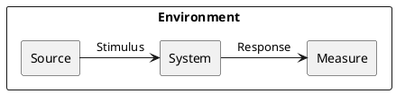

*Stimulus*: condition affecting the system

*Source*: entity generating the stimulus

*Environment*: context under which stimulus occurred (e.g., build, test, deployment, startup, normal operation, overload, failure, attack, change)

*Response*: observable result of the stimulus

*Measure*: benchmark or target value defining a successful response


}

## Example Scenario

Quality: _Recoverability_

Scenario: In case of power failure, rebooting the system should take up to 20 seconds.


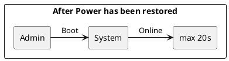
## Local Guide Scenarios

Quality: _Availability_

Scenario: In case of loss of network connectivity on the users side, the system is supposed to fetch the required data from realm, and sync it with the interface to be displayed to the user.

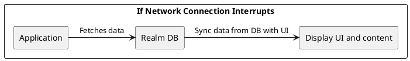
Quality: _Modifiability_

Scenario: Developer wants to update details in the database for a particular category

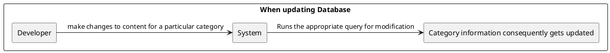

Quality: _Functionality_

Scenario: System stores the browsing details of the user as preferences within the columns category_id and shop_name in the database.

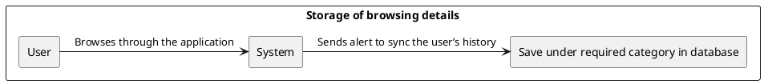

Quality: _Usability_

Scenario: If a new user faces issues in operating the application, the system suggests the help button to them, and operation afterwards going through the help shouldn't take more than 3 minutes.

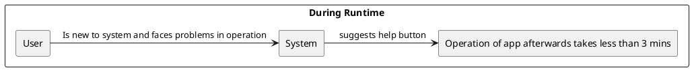

Quality: _Interoperability_

Scenario : The user selects the directions button for a particular shop, the app should be able to correctly map the location to the place selected by the user and display it on google maps.

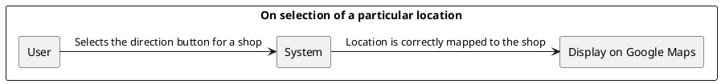

Quality: _Security_

Scenario: Have the connected authentication api be called at the time of login into the application by the user.

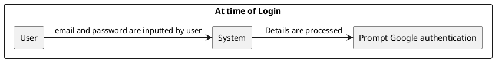

Quality: _Changeability_

Scenario: Addition of a new payment processing method for the in app purchases.

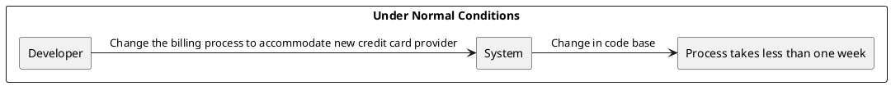


# Ex - Quality Attribute Tradeoff

## Portability vs. Performance (Example)

Developing an app natively for each OS is expensive and time consuming, but it benefits from a good performance. Choosing a cross-platform environment on the other hand simplify the development process, making it faster and cheaper, but it might suffer in performance.

# Trade-offs

## Extensibility and Design Consistency


In order to keep the operations simplified and easier to identify for the users, a same design pattern needs to be maintained, across all the different screens of the application - so that users do not get confused when trying out different alternatives in the app. Keeping design consistent does hold up customer’s expectations but for future prospects, growing the architecture further will put a lot of constraints on the development of the app and more time and effort in implementation.

## Customizability and Composability


Creating a lot of customizations for the users in the application will make the app more useful and assist them in more advanced levels, but it would require many sub components and interconnections within the app which would lead to utilization of  a lot of resources and increment of development costs.

## Adaptability and Performance

As an application that works as a guidebook for the users, one of the prime advantages is that it can be highly adaptable to the user’s preferences, interests, and new trends in the market, but as the complexity increases, it will overload the development process, leading to possible reductions in performance.

# Ex - Feature Modeling

{.instructions

In the context of your chosen project domain, describe your domain using a feature model.

The feature model should be correctly visualized using the following template:


}


```puml
@startuml
rectangle "Personalize (app)" as A
rectangle "Sync preferences" as B 
rectangle "Wishlist” as C 
rectangle “Connect with Social media” as Z

A *-- B
A *-- C
A *-- Z

rectangle "Browse" as H
rectangle “Search” as DQ
rectangle "Select Category" as DQA

 DQ -- DQA
rectangle “Filtering” as E
rectangle “Distance” as EA
rectangle “Price” as ED
rectangle “Ratings” as EB
rectangle “Most Popular” as EC
rectangle "Services" as ET 
rectangle "Incentives" as EW 
 

E *-- EA
E *-- ED
E *-- EB
E *-- EC
E *-- ET
E *-- EW
rectangle “Additional Info” as F

H *-- DQ
H *-- E
H *-- F

rectangle "GPS" as Q 
  note left
  Implemented by <&map-marker>
end note
rectangle "Security" as K
rectangle "Google Authentication" as Y
rectangle "OTP" as U

K o--Y
K o--U

rectangle “Mode" as M 
rectangle “Traveler” as T 
rectangle “Settler” as S 

M o--T
M o--S

rectangle "Reviews" as N
rectangle “Purchases” as P
rectangle “ View” as J 
rectangle “ Avail Offers” as W 
rectangle “Subscriptions” as D

P *-- J
P *-- W
P *-- D

rectangle “Transport Services” as L 
rectangle “Bus” as FD
rectangle “Train” as DW
rectangle “Bicycle” as DE
L *-- FD
L *-- DW
L *-- DE

rectangle “Bookings” as X
rectangle “Hotels” as  XA
rectangle “Tours” as XB
rectangle “Restaurants” as XC

X *-- XA
X *-- XB
X *-- XC

DQ-[dotted]> E : require
W -[dotted]> B : require

rectangle "Local Guide"  as R 

R --@ A
R --@ H 
R --@ Q 
R --@ K
R --@ N 
R --0 L
R --0 X
R --0 P
R --0 M

skinparam monochrome true
skinparam shadowing false
skinparam defaultFontName Courier
@enduml
```


# Ex - Context Diagram

{.instructions

Prepare a context diagram to define the design boundary for your project.

Here is a PlantUML/C4 example to get started.


}


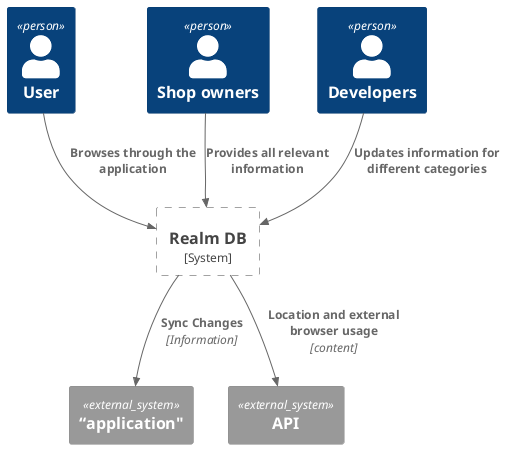


# Ex - Component Model: Top-Down

{.instructions

Within the context of your project domain, represent a model of your modular software architecture decomposed into components.

The number of components in your logical view should be between 6 and 9:

- At least one component should be further decomposed into sub components
- At least one component should already exist. You should plan how to reuse it, by locating it in some software repository and including in your model the exact link to its specification and its price.
- At least one component should be stateful.

The logical view should represent provide/require dependencies that are consistent with the interactions represented in the process view.

The process view should illustrate how the proposed decomposition is used to satisfy the main use case given by your domain model.

You can add additional process views showing how other use cases can be satisfied by the same set of components.

This assignment will focus on modularity-related decisions, we will worry about deployment and the container view later.

Here is a PlantUML example logical view and process view.

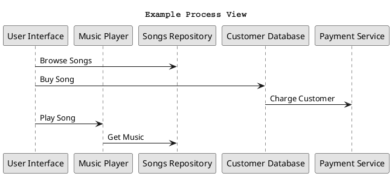

Hint: How to connect sub-components to other external components? Use this pattern.

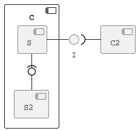


}

## Logical View 

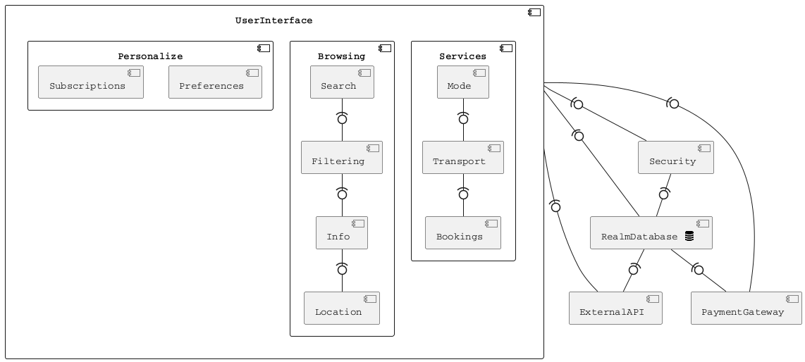


## Process Views

Use case 1 : User operates the application

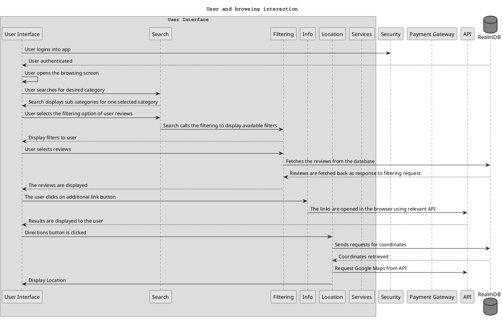

Use Case 2 : User makes a purchase within the application

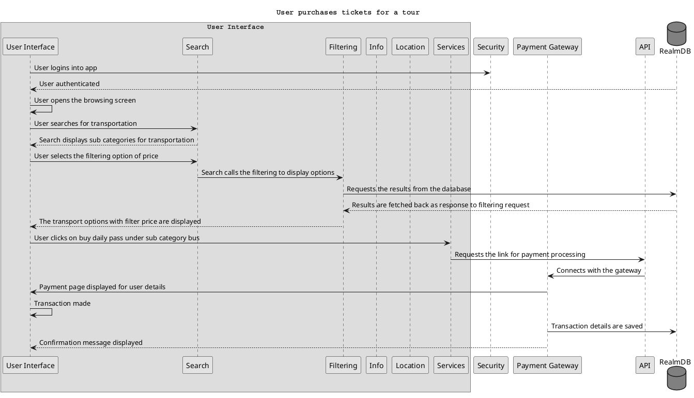
Use Case 3 : Subscription process in the application

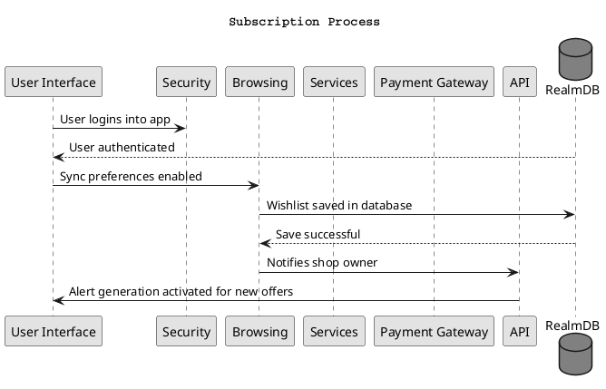

Use case 4 : Selection of App Mode (Traveller/Settler) by the User

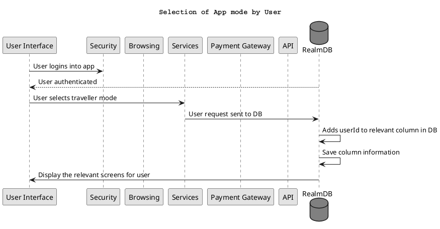


# Ex - Component Model: Bottom-Up

{.instructions

Within the context of your project domain, represent a model of your modular software architecture decomposed into components.

To design this model you should attempt to buy and reuse as many components as possible.

In addition to the logical and process views, you should give a precise list to all sources and prices of the components you have selected to be reused.

Write an ADR to document your component selection process (indicating which alternatives were considered).

}

## Logical View

```puml
@startuml
!include <tupadr3/font-awesome/database>
note top of UserInterface
   Instead of being coded from scratch, 
   Google's Material design UI kit will be 
    used, which already has code available 
    to design all the needed components.
end note
component UserInterface {
component Services {
      component Transport
      component Bookings
      component Mode

}
component Browsing{
     component Search
     component Filtering
     component Info
     component Location
 }
 component Personalize{
   component Login
   component Preferences
   component Subscriptions
 }
}

component [Firebase <$database{scale=0.33}>] as Firebase
component ExternalAPI
component PaymentGateway
note bottom of PaymentGateway
   uses built-in system Stripe
end note


UserInterface -(0- Firebase
UserInterface -(0- ExternalAPI
UserInterface -(0- PaymentGateway
Firebase -0)- ExternalAPI
Firebase -0)- PaymentGateway


skinparam monochrome true
skinparam shadowing false
skinparam defaultFontName Courier
@enduml
```

Price and specification of components

Material Design UI toolkit for component User Interface

Price: free

Specs: https://material.io/components?platform=android

Firebase for stateful component Database

Price: free at start but gradually increases if application is scaled up

Specs : 
* https://firebase.google.com/docs/android/setup
* https://firebase.google.com/docs/database/android/start
* https://firebase.google.com/

Payment Gateway : Stripe

https://github.com/firebase/functions-samples/tree/main/stripe


## Process Views

Use case : User operating the application with all of its functionalities 

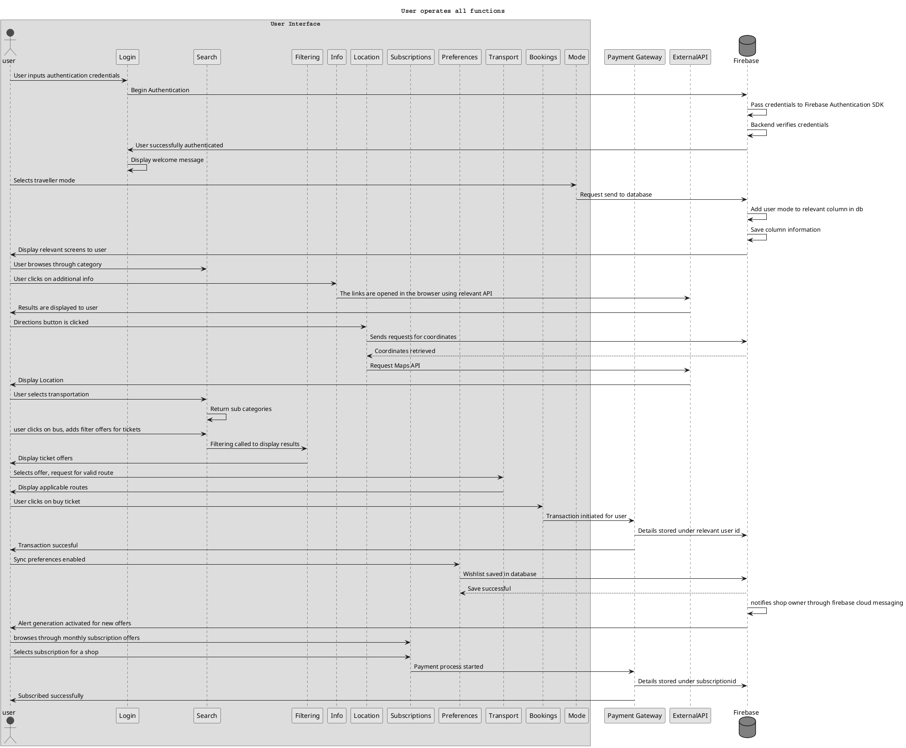

Use case 2 : User creating check-in request in Bookings component

```puml
@startuml

box "User Interface"
actor user #red
participant Login as LG
participant Search as SH
 participant Filtering as FG
 participant Info as IN
 participant Location as LO
participant "Subscriptions" as SN
participant "Preferences" as PN
participant "Transport" as TP
participant "Bookings" as BP
participant "Mode" as MD
  end box

participant "Payment Gateway" as PS
participant "ExternalAPI" as AP
database Firebase #grey

user -> LG : User logins into app
Firebase -> user : User authenticated
user -> BP : Create a reservation
BP -> BP : Filter reservations
BP -> BP: Create check-in request
BP -> AP: Webhook for check-in request
AP -> BP: Fetch check-in request
AP -> AP: Check if check-in is possible
AP -> BP : Move to Data_required
BP -> user : Send email asking for details
rnote over user
  End of flow 
  if user never responds
end rnote
user -> BP : Fills out check-in form
BP -> BP: Change check-in status to requested
BP -> AP : Webhook for check-in request
AP -> BP: Fetch check-in request
AP -> AP : Checks if information provided is valid, completes pre check-in
AP -> BP: Send room access info and change check-in to Success or Denied.
rnote over AP
  Room access info may 
  include QR codes, door codes,
  directions to the place etc.
end rnote

BP -> user : Send email with confirmation or denial
rnote over user
  Follow instructions
  to get access to room
end rnote

skinparam monochrome true
skinparam shadowing false
skinparam defaultFontName Courier
@enduml
```

## ADR 1 : Selection of UI toolkit
 
1. What did you decide?
 
UI Toolkit : Material Design

2. What was the context for your decision?
 
The aim of this decision is to find the most optimal solution so that the development time for the user interface can be reduced considerably
 
What is the goal you are trying to achieve?

Design an interface that is appealing to the users and consumes less work hours.
 
What is the scope of your decision? Does it affect the entire architecture?
 
The decision only impacts the look and feel of the mobile app
 
 3. What is the problem you are trying to solve?
 
How can a developer create the most user friendly app with minimal effort and less code?
 
4.  Which alternative options did you consider?
 
* Material Design
* Jetpack compose
 
5. Which one did you choose?
 
Material Design

6. What is the main reason for that?
 
It comprises all the features that will be implemented for the application, and as the app caters to the tourism industry, it needs to have an aesthetic appeal, and that particular purpose is fulfilled by Material’s pre-written code for different types of UI components.
 
List the positive consequences (pros) of your decision:
 
* Reduction of code, which would otherwise increase the workload if hardcoded in java
* As it is developed by Google, makes it more easier to integrate with api’s efficiently 
 
 
## ADR 2 : Selection of a different database
1. What did you decide?

Firebase


2. What was the context for your decision?
 
The goal of this decision was to find another database which offers all the features as the previously selected one (Realm Database), and offers a method to integrate the Security component of the app within the database itself.
 
What is the scope of your decision? Does it affect the entire architecture?
 
As the database is the main component dealing with storage and querying, this decision impacts the entire structure of the application
 
3. What is the problem you are trying to solve?
 
How can the selection of the database be maneuvered in such a way that it handles the security component and effortless integration with Google APIs? 
 
4.  Which alternative options did you consider?
 
* Firebase
* Cloud Firestore
* Elasticsearch
 
5. Which one did you choose?

Firebase

6. What is the main reason for that?
 
The main purpose that will be served by firebase is integration of the security component within itself, and also as the developer has already experience with this technology, it will be less time consuming as compared to the previous decisions of Realm Database, which required everything to be learned from scratch.
 
List the positive consequences (pros) of your decision:
 
* As a Google Cloud service, it also gives you access to other Google products and features, in this case the UI toolkit and api
* When the app is linked with Firebase, there is no need for creation of a separate login interface, as its built-in login UI can be utilized to sign users into the app


# Ex - Interface/API Specification

{.instructions

In this iteration, we will detail your previous model to specify the provided interface of all components based on their interactions found in your existing process views.

1. choose whether to use the top down or bottom up model. If you specify the interfaces of the bottom up model, your interface descriptions should match what the components you reuse already offer.

2. decide which interface elements are operations, properties, or events.

Get started with one of these PlantUML templates, or you can come up with your own notation to describe the interfaces, as long as it includes all the necessary details.

The first template describes separately the provided/required interfaces of each component. 


The second template annotates the logical view with the interface descriptions: less redundant, but needs the logical dependencies to be modeled to show which are the required interfaces.


}

## API Specification:

```puml
@startuml

component UserInterface

component RESTAPI
interface " " as iRESTAPI

component Firebase
interface " " as iFirebase

component Stripe
interface " " as iStripe

component LocalGuideDB
interface " " as iLocalGuideDB

component WebAPI

UserInterface --( iRESTAPI
UserInterface --( iFirebase
iRESTAPI - RESTAPI
RESTAPI--( iFirebase
WebAPI --( iRESTAPI
iFirebase - Firebase
Stripe--( iFirebase
iStripe- Stripe
LocalGuideDB --( iFirebase

UserInterface -( iLocalGuideDB
iLocalGuideDB - LocalGuideDB
UserInterface --( iStripe


note bottom of iRESTAPI
operations:
..
getcategories(string)
getsubcategories
getFilters
getUserPreference(subscription_id,shop_id,offer_id)
getLocation
getTransactionLink
getExternalURL
end note


note bottom of iFirebase
operations:
..
storeStripeKey
getData
updateData
saveData
deleteData
--
properties:
..
category
filter
usercredentials
mode
transport
subscriptions

end note


note top of iStripe
operations:
..
createCustomer
createCheckoutSession
createPortalLink
handleWebhookEvents
onUserDeleted
onCustomerDataDeleted
setPaymentMethod
setInvoiceSettings
--
events:
..
product.updated
product.deleted
price.created
price.updated
price.deleted
checkout.session.completed
customer.subscription.created
customer.subscription.updated
customer.subscription.deleted
invoice.paid
invoice.payment_succeeded
invoice.payment_failed
invoice.upcoming
invoice.payment_action_required
end note

note right of iLocalGuideDB
operations:
..
createUserSignIn
setAuthenticationproviders
writeUserdata( userID, name,email)
storecategories(string)
storesubcategories
storeFilters
storeLocation
storeExternalURL
getGoogleMapsAPI
getGooglePlacesAPI
getBookingsAPI
storeUserCredentials
storeTransactionDetails
storeUserPreferences
storeUserSubscriptions
end note

skinparam monochrome true
skinparam shadowing false
@enduml
```

Local Guide component refers to the database created inside the Firebase console.
## Open API Description
 

# Ex - Connector View

{.instructions

Extend your existing models introducing the connector view


For every pair of connected components (logical view), pick the most suitable connector. Existing components can play the role of connector, or new connectors may need to be introduced.

Make sure that the interactions shown in the process views reflect the primitives of the selected connector


}


 

New Connectors
1. ConnectAPI which stands for Stripe Connect, which is essentially a platform that enables specific users of the app, targetted towards shop owners and online marketplaces which will enable them to get paid via stripe. On top of that it offers owners the functionality of tools such as CRM analytics.

2. Transport API is the local Swiss Public Transport API, which covers public transport within Switzerland. The API uses a web service provided by search.ch. It has resources for locations, connections, station board etc.

Specs: 

https://transport.opendata.ch/docs.html

https://timetable.search.ch/api/help

Existing Connectors

1. REST API is the Firebase REST API, which will be used for all the calls between the components.

### Process Views

Use case 1: Operation using the Transport API

```puml
@startuml
title Basic functionality of app
box "User Interface"
actor user #red
participant Login as LG
participant Search as SH
 participant Filtering as FG
 participant Info as IN
 participant Location as LO
participant "Subscriptions" as SN
participant "Preferences" as PN
participant "Bookings" as BP
participant "Transport" as TP
participant "Mode" as MD
  end box
entity TransportAPI as TAP
entity ConnectAPI as SC
entity StripeAPI AS SP
participant "Stripe" as PS
entity RESTAPI as AP
database Firebase #grey

user -> LG: User inputs authentication credentials
LG -> Firebase: Begin Authentication
Firebase->LG : User successfully authenticated
user -> SH :User browses through categories
user-> SH: User clicks on Grocery
SH->Firebase: GET sub category Supermarket
Firebase-> user: Display sub category
user -> IN: User clicks on additional info
IN -> AP: GET https://example.com/summer-sale
AP --> user: Display link
user -> LO: Directions button is clicked
LO ->Firebase: POST coordinate_request
Firebase -> Firebase : GET coordinates
Firebase -> AP : GET Maps API
AP -->user : Display location
user -> SH : User selects transportation
SH -> SH : Return sub categories
user -> TP : User clicks on train
TP->FG : Filtering called to display results
FG->user: Relevant results displayed
user->TP: User clicks on locations
TP->TAP:  GET http://transport.opendata.ch/v1/locations
TAP-->user: Return /v1/locations
TP->TAP: GET http://transport.opendata.ch/v1/connections?from=Lausanne&to=Genève
TAP-->user: Return /v1 /connections
user->TP: User clicks station board
TP->TAP: GET http://transport.opendata.ch/v1/stationboard
TAP-->user: Return /v1/stationboard

skinparam monochrome true
skinparam shadowing false
skinparam defaultFontName Courier
@enduml
```


Use case 2: Operation using Stripe Connect API
```puml
@startuml
title Operation of Stripe Connect
box "User Interface"
actor user #red
participant Login as LG
participant Search as SH
 participant Filtering as FG
 participant Info as IN
 participant Location as LO
participant "Subscriptions" as SN
participant "Preferences" as PN
participant "Bookings" as BP
participant "Transport" as TP
participant "Mode" as MD
  end box
entity TransportAPI as TAP
entity ConnectAPI as SC
entity StripeAPI AS SP
participant "Stripe" as PS
entity RESTAPI as AP
database Firebase #grey

user -> LG: Shop owner inputs auth credentials
LG -> Firebase: Begin Authentication
Firebase -> Firebase : Pass credentials to FirebaseAuth
Firebase ->Firebase : .getCurrentUser
Firebase-->LG : Owner successfully authenticated
LG->user: Display welcome message
user->SC: POST /v1/accounts with cardPayments,transfers,type,country,email,company,APIKey 
SC-->user: Return /v1/accounts
user->SC: POST/v1/account_links with account,refresh_url,return_url,type=account_onboarding,collect 
SC-->user: Return "https://connect.stripe.com/setup/s/h0Pj5SzjFTqm"
user->SC:  POST /v1/payment_intents with attributes id,amount,automatic_payment_methods,charges,client_secrent,currency,customer,description,last_payment_error,payment_method,status
SC->user: Return /v1/payment_intents
user->SC: POST /v1/payment_methods with id,billing_details,customer,type,customer_balance,card_present
SC-->user:Return payment_methods
user->SC: POST /v1/customers with id.object,address,create,currency,discount,email.invoice_settings,phone,name,shipping,preferred_locales
SC-->user: Return /v1/customers
user-> SC: POST /stripe_webhooks
SC-->user: Return /stripe_webhooks
user->SC: GET /v1/events/:id
SC-->user: Return events

skinparam monochrome true
skinparam shadowing false
skinparam defaultFontName Courier
@enduml
```


### ADR 1: Selection of API connector

1. What did you decide?

API as a connector

2. What was the context for your decision?
 
The goal is to fix the  mismatch for the transport sub component in the UI. 
 
What is the scope of your decision? Does it affect the entire architecture?
 
It affects only the user interface of the application, as transport is a sub component in it

 
3.  Which alternative options did you consider?
 
* API connector
* A shared database with information on transport
* tuple with different transport functionalities mapped inside of it

4. Which one did you choose?

API connector

5. What is the main reason for that?
 
The main reason for this selection is primarily the mismatch between the transport sub component of the interface,as there were no relevant shared databases as such to get the information, as for now the app is restricted to transportation within switzerland, and no other type of connector is valid for the interaction I wanted to show, so I decided to go ahead with the transport api which provides public transport within Switzerland. The API uses a web service provided by search.ch

List the positive consequences (pros) of your decision:
 
* Since the api connector has the information for transport specific to switzerland, it helps to narrow down the work for the developer and eliminates the need to create a new component from scratch.
* Handles the mismatch between the component functionality.

# Ex - Adapters and Coupling

{.instructions

1. Highlight the connectors (or components) in your existing bottom-up design playing the role of adapter. (We suggest to use the bottom-up design since when dealing with externally sourced components, their interfaces can be a source of mismatches).
2. Which kind of mismatch** are they solving?
3. Introduce a wrapper in your architecture to hide one of the previously highlighted adapters
4. Where would standard interfaces play a role in your architecture? Which standards could be relevant in your domain?
5. Explain how one or more pairs of components are coupled according to different coupling facets
6. Provide more details on how each adapter solves the mismatches identified using pseudo-code or the actual code
7. How can you improve your architectural model to minimize coupling between components? (Include a revised logical/connector view with your solution)

}

### Adapter in bottom-up Model

The bottom-up model has changed from its previous version as in the Connector view assignment, Transport componenent was removed from being the sub component in the User Interface and now will be an external componennt connected to the interface with the relevant api acting as the adapter. 

The three adapters already functional are:
* Firebase API 
* Transport API 
* Stripe API


### Mismatch solved
The name of the functions that will be resolved in the mismatch are listed in the code below.

1. Firebase API served as the main adapter for coordinating the calls between the user interface and the database.

The set of functions performed at the user interface side will be something as follows:

function requestCategories
function getLocations
function requestStationDetails
function requestOptions
function requestPlaces
function requestConnections
function sendQueries
function sendPaymentRequest
function getPlacesNearMe

All of these functions will be a set of inputs given by the user, and the api adapters include the set of functions that help perform the specific response for each of these function sets.


2. Transport API solves the mismatch of the mobile app having transport functionality within itself(booking transport around swiss),the api directs the user to the trnsprt.ch, through which they can search the conenctions between the desired locations.

3. Using Stripe api as the adapter, it solves the mismatch  by connecting the user interface to external payment gateway Stripe.

### Wrapper

```puml
@startuml

interface " " as I
component FirebaseHelper {
component FirebaseAPI
FirebaseAPI - I
component Firebase

interface Internal as i

Firebase - i

FirebaseAPI --( i

}
component UserInterface{
component Services {
      component Bookings
      component Mode

}
component Browsing{
     component Search
     component Filtering
     component Info
     component Location
 }
 component Personalize{
   component Login
   component Preferences
   component Subscriptions
 }
}

UserInterface --( I
component Transport
component Stripe
interface " " as I

interface " " as w
UserInterface --( w
Transport - w

Stripe --( I

[<<Adapter>> StripeAPI] as AD
Stripe -AD
AD - UserInterface
@enduml
```


### Standard Interfaces
Considering the standard interfaces required in the tourism domain,almost all of the components of the bottom-up model conform to the most widely used interfaces when designing of such an application. So for example, in the category of platforms- mobile apps are more in demand than websites/web apps, and the widely used databases for such domains include: Firebase, MySQL, SQLite, MongoDB etc. Earlier in the top-up model, unconventional databases (like RealmDB) were being used, but the model that currently stands is refined to set of standards defined.

### Coupling Facets

##### Platform Independence
The architecture essentially is platform independent, as the database being used for the application is Firebase, which has support for quite a lot of languages: java, swift, kotlin etc. and also for both the platforms: web and android. In the future, if the implementation will have to be shifted to another language, the client side could only notice slight changes in the UI, but the internal functionality will remain the same.

##### Interaction
The interaction between user  and the external components cannot be indirect. Considering the first case, the user interface makes use of the firebase rest api which plays the role of an adapter pulling data from firebase and displaying to the end user.

##### Session
The interactions between the user and the app in general, does not depend on the previous selections made by the user, as there is no explicit save of user history, unless user turns on the preferences option in the settings.


### Pseudo code
Adapter Transport API

```
GET URL = 'https://timetable.search.ch/api/'
SET ClientIpAddress
SET ClientUserAgent

function sendAndParseQuery(query)  \\parses the query from the client side, fetches the result on the timetable.ch link
  {
     response = sendQuery(query)
     if (response =isServerError()) {
         throw Exception(‘'Server error from timetable.search.ch: '.response->getStatusCode().' '.response->getReasonPhrase());
   }
   content = response->getContent();
   result = json_decode(content);

        if (response->getStatusCode() == 429) {
            throw new HttpException(429, 'Rate limit error from timetable.search.ch: '.content);
        .
        .
        .

        return result;
    }
function sendQuery(query, url = self::URL)
    {
        formRequest = query->toFormRequest();
        formRequest->setField('ip_address', this->clientIpAddress);
        formRequest->setField('user_agent', this->clientUserAgent);

        return this->browser->send(formRequest);
    }
function findConnections(ConnectionQuery) \\ performs the response action for user asking for connections between two locations
    {
        result = this->sendAndParseQuery(query);
        connections = [];

        from = null;
        to = null;
        stations = [
            'from' => [],
            'to'   => [],
        ];
    result = [
            'connections' => connections,
            'from'        => from,
            'to'          => to,
            'stations'    => stations,
        ];

        return result;
    }
function findLocations(LocationQuery query) \\ performs response action for user asking for locations on the map
    {
        result = this->sendAndParseQuery(query);
        locations = [];
        foreach (result as location) {
            locations[] = Entity\LocationFactory::createFromJson(location);
        }

        return locations;
    }
function getStationBoard(StationBoardQuery query) \\performs response action for user asking for station details
    {
        result = this->sendAndParseQuery(query);
        station = Station::createStationFromJson(result->stop);
        journeys = [];
        if (result->connections) {
            foreach (result->connections as connection) {
                journey = Entity\Schedule\StationBoardJourney::createFromJson(connection, null);
                journey->stop->station = station;
                journeys[] = journey;
            }
        }
        stationboard = ['station' => station, 'stationboard' => journeys];
        return stationboard;
    }
}
```
Adapter Firebase API

Getting categories:

```
function getAllCategories = async (req: Request, res: Response) => {
  try {
    function allCategories = await db.collection('Categories').get()
    return res.status(200).json(allCategories.docs)
  } catch(error) { return res.status(500).json(error.message) }
}
export { addCategory, getAllCategories }

```

Getting places:
```
function findPlace(string input, string inputType, array  = []) \\ performs response action for user requesting places 
    {
        response = makeRequest(self::FIND_PLACE, )
        return convertToCollection(response, 'candidates')
    }
function nearbySearch(string location, string radius = null, array  = []) \\ performs response action for user requesting places near their location
    {
        response = makeRequest(self::NEARBY_SEARCH_URL, )
        return convertToCollection(response, 'results')
    }
function placeDetails(string placeId, array  = []) \\ performs response action for user requesting places
    {
        response = makeRequest(self::DETAILS_SEARCH_URL, )
        return convertToCollection(response)
    }    
function getOptions(array , string method = 'get') \\gets response for user requesting options
    {
        options = [
            'query' => [
                'key' => key,
            ],
        ]
        if (method == 'post') {
            options = array_merge(['body' => json_encode()], options)
        } else {
            options['query'] = array_merge(options['query'], )
        }
        
        options['http_errors'] = false
        
        if (!empty(headers)) {
            options['headers'] = headers
        }
        return options
```

### Improvement of Model 
I believe that the current model of the system is already exhibiting minimized coupling, the user interface has only two external dependencies, the database,payment gateway and transport. However in the payment option, instead of having the necessary adapter connect api (which enables creation of custom accounts in Stripe), this option can be kept optional thus leaving with only one api that is the Stripe API acting as the adapter.

# Ex - Physical and Deployment Views

{.instructions

a. Extend your architectural model with the following viewpoints:

1. Physical or Container View

2. Deployment View

Your model should be non-trivial: include more than one physical device/virtual container (or both). Be ready to discuss which connectors are found at the device/container boundaries.

b. Write an ADR about which deployment strategy you plan to adopt. The alternatives to be considered are: big bang, blue/green, shadow, pilot, gradual phase-in, canary, A/B testing.


}


### Physical view

```puml
@startuml
node "Android Mobile Device" as a1

cloud GoogleCloud as w
node "Web Server 1  " as e 
node "Web Server 2" as f

a1 -- w
a1 -- e
a1 -- f
e -- w

@enduml
```

The web server 1 is for Stripe, and the web server 2 is for Transport.

### Deployment View

```puml
@startuml


node "Web Server" as d {
component Transport as b
component Stripe as s
}

node "Android mobile device" as a {
node "Local Guide APK" {
component UserInterface {
component Services {
      component Bookings
      component Mode

}
component Browsing{
     component Search
     component Filtering
     component Info
     component Location
 }
 component Personalize{
   component Login
   component Preferences
   component Subscriptions
 }
}
}
}

node "Google Cloud"  {
  component Firebase as f 
  component FirebaseConsole
}

a -- f : HTTPS
a -- b : HTTPS
a -- s : HTTPS
f -- s : HTTPS
@enduml
```

The mobile Android device is host to and responsible for the Local guide mobile APK. Within the application there are several components that provide the core functionality of the application and are responsible for communication with Google Firebase and Google Cloud.

The Google cloud servers contains several elements. The Firebase console component is essential for managing the services/analytics that Google Firebase provides but it is also crucial for managing data requests from the local guide mobile application. The console communicates with the database which has a container for storing all relevant information created by the local guide application as collections (which goes beyond the scope).

## ADR for Deployment Strategy

1. What did you decide?

Pilot
 
2. What is the problem you are trying to solve?
  
 What will be the most suitable deployment strategy for an app catering to the needs of a particular target audience locally?

3.  Which alternative options did you consider?
 
* Pilot
* Canary
* A/B Testing
* Gradual Phase in
 
4. Which one did you choose?

Pilot

5. What is the main reason for that?
 
The pilot is somewhat closely related to the big bang appraoch, but offers a slight different insight. With this strategy, instead of going live all at once, the application is deployed to a small and targeted group of users who can use the system in a controlled environment. This helps to gather user feedback, make changes and adjustments and improve the overall quality of the application.
 
6. List the positive consequences (pros) of your decision:
 
 * If there are problems in the application, they are easier to catch and rectify if deployed initially to a limited set of users
 * A bit cheaper than having multiple versions in production, as only one version is in usage.


# Ex - Availability and Services

{.instructions 

The goal of this week is to plan how to deliver your software as a service with high availability.

1. If necessary, change your deployment design so that your software is hosted on a server (which could be running as a Cloud VM). Your SaaS architecture should show how your SaaS can be remotely accessed from a client such as a Web browser, or a mobile app
2. Sketch your software as a service pricing model (optional)
3. How would you define the availability requirements in your project domain? For example, what would be your expectation for the duration of planned/unplanned downtimes or the longest response time tolerated by your clients?
4. Which strategy do you adopt to monitor your service's availability? Extend your architecture with a watchdog or a heartbeat monitor and motivate your choice with an ADR.
5. What happens when a stateless component goes down? model a sequence diagram to show what needs to happen to recover one of your critical stateless components
6. How do you plan to recover stateful components? write an ADR about your choice of replication strategy and whether you prefer consistency vs. availability. Also, consider whether event sourcing would help in your context.
7. How do you plan to avoid cascading failures? Be ready to discuss how the connectors (modeled in your connector view) impact the reliability of your architecture.
8. How did you mitigate the impact of your external dependencies being not available? (if applicable)


}

## 1. 

```puml
@startuml


node "Web Server 1" as d {
component Transport as b
}
node "Web Server 2" as o {
component Stripe as s
}

node "Web Browser" as a {
component UserInterface {
component Services {
      component Bookings
      component Mode

}
component Browsing{
     component Search
     component Filtering
     component Info
     component Location
 }
 component Personalize{
   component Login
   component Preferences
   component Subscriptions
 }
}
}


cloud GoogleCloud  {
  component Firebase as f 
  component FirebaseConsole
}

a -- f : HTTPS
a -- b : HTTPS
a -- s : HTTPS
f -- s : HTTPS
@enduml
```

## 2.  SaaS Pricing Model

Freemium Model will be the most benefical saas pricing model for my application as it is a travel app, users would first like to try it and see what features or functionalities they actually prefer or might not in the initial stage. So keeping that in mind, under the freemium model - there will be two versions essentially:

Free Version
*  Search and Maps navigation
*  Recommendations based on user preference
*  Reviews and feedback
*  Offline access


Premium Version
Having two subscription options: monthly subscription at $4 and annual subscription at $18
* 20% discount at all stores affiliated with Local guide
* Booking services for both transport and tours
* Translation services

* Currency Converter
* Customized Itinerary generator

## 3. Availability Requirements

Being available as a travel app that is accesible to the user to guide them is important. They would want that all the important information is displayed, the maps navigation and search queries work effortlessly. The load of availability increases with the premium users, as they have access to more features within the app. The average database query time should be around 100-200ms, considering that the database is deployed on cloud. The average load time should be under 5 seconds max, or users can lose interest easily as compared to the best practice to display content to the users under 3 seconds.
## 4. Monitor Availability

```puml
@startuml

component UserInterface{
component Services {
      component Bookings
      component Mode

}
component Browsing{
     component Search
     component Filtering
     component Info
     component Location
 }
 component Personalize{
   component Login
   component Preferences
   component Subscriptions
 }
}

component Firebase
component Transport
component Stripe
component Watchdog as t
component Watchdog as q

[<<Adapter>> StripeAPI] as AD
Stripe -AD
AD - UserInterface

interface " " as w
UserInterface --( w
Transport - w

interface " " as f
Firebase - f
UserInterface --( f

Stripe --( f
t --( f
q --( w


skinparam monochrome true
@enduml
```
### ADR for Component to monitor availability

1. What did you decide?

Watchdog to keep track of availability of our services.

2. What are the constraints?

* Different watchdogs will have to be implemented for each of the services to be monitored seperately.

What is the scope of your decision? Does it affect the entire architecture?

As the decision involves monitoring of every component's tasks, it does affect the entire architecture.


3.  Which alternative options did you consider?

* Watchdog
* Heartbeat

4. Which one did you choose?

Watchdog

5. What is the main reason for that?

List the positive consequences (pros) of your decision:

* cost effective method of detecting and handling faults

If any, list the negative consequences (cons)

* Watchdog clock stops functioning ( if the watchdog is not getting clock cycles then it is not able to run its code for faults)


## 5. Stateless Component Recovery

```puml
@startuml 
box "User Interface"
actor user 
participant Login as LG
participant Search as SH
 participant Filtering as FG
 participant Info as IN
 participant Location as LO
participant "Subscriptions" as SN
participant "Preferences" as PN
participant "Bookings" as BP
participant "Mode" as MD
  end box
participant "Stripe" as PS
participant "Transport" as TP
participant "Watchdog" as WD
database Firebase #grey

user -> LG: User inputs authentication credentials
LG -> Firebase: Begin Authentication
Firebase->LG : User successfully authenticated
user -> SH :User browses through categories
SH -> Firebase : User request for categories sent
hnote over Firebase  : System Down
WD -> Firebase: checkStatus()
activate Firebase
Firebase -> WD: Inactive()
deactivate Firebase
activate WD
WD -> WD : recoverDb()
deactivate WD
WD ->Firebase : request_category_recovery()
activate Firebase
Firebase -> Firebase: recover_category()
Firebase -> WD: category_recovered()
deactivate Firebase
Firebase --> SH : send_category()

skinparam monochrome true
skinparam shadowing false
skinparam defaultFontName Courier
@enduml
```


## 6. Recovery of Stateful Components

The most efficient way to recover the failure of a stateful component, is storing the same data (replicas) in multiple locations, which will be achieved by the below discussed replication strategy.

### ADR for Replication Strategy

1. What did you decide?

Asynchronous Replication

2. What was the context for your decision?

It is evident that the stateful component, which in our case is the main database itself, has good probability of going down, which will lead to the entire loss of application data, which is undesirable. Having replicas of the data ensures that a consistent backup is maintained in the event of a disaster, hardware catastrophe, or a system breach, which can compromise data.

What is the goal you are trying to achieve?

What are the various ways in which the stateful component can be replicated for safekeeping?

What are the constraints?

* A sound number of replicas will have to be created, with atleast one replica being the minimum requirement.
* We would want the travel app to provide eventual consistency in its operations, but there could be a possibility  that data in the replicas is not consistent.

What is the scope of your decision? Does it affect the entire architecture?

As the decision pertains only to the stateful component, it does not affect the entire architecture.

3. What is the problem you are trying to solve?

Is there possible way of recovery for a stateful component without major data loss?

4. Which alternative options did you consider?

* Asynchronous replication
* Synchronous replication

5. Which one did you choose?

Asynchronous Replication

6. What is the main reason for that?

List the positive consequences (pros) of your decision:

* It is designed to work over long distances. Since the replication process does not have to occur in real time, asynchronous replication can tolerate some degradation in connectivity
* More resilient than synchronous replication, as in synchronous - a single failure could cause loss of service and viruses or other malicious components that cause data corruption might be replicated to the second copy of the data.
* Provides fast response and has the least impact on the response time of the primary application

If any, list the negative consequences (cons)

* Data loss might occur at the secondary site after primary site or network failures

At this stage, event sourcing is not helpful in my context, as the application provides direct information to the user and there is no usage for storage of related events that happened previously. 

## 7. Avoid Cascading Failures

When one service synchronously invokes another there is always the possibility that the other service is unavailable or is exhibiting such high latency it is essentially unusable. In such a case, implementation of Circuit Breaker helps in preventing failires and enable resilience.

Essentially, resilience4j is one such lightweight and fault tolerant library that allows the integration of a circuit breaker within the system.
It is implemented via a finite state machine with three normal states: CLOSED, OPEN and HALF_OPEN and two special states DISABLED and FORCED_OPEN and uses a sliding window to store and aggregate the outcome of calls.

The pros would be that such a methodology would be helpful to respond to a hazardous condition and makes the system fault tolerant at a fine level of activity.
But the cons are that testing could be hard, as variety of ailure responses need to be in force and these responses need to be tested.

## 8. Mitigation of External Dependices

In my application, a lot of the functions provided need the assistance of external components such as the transport services and payment gateway. At this point there is an external dependency to these features as there is no efficient way of providing those services to the users, but the following steps could be implemented in practice to manage them better:

* Selecting dependencies with least amount of issues: checking the tone of the discussions, the age of the topics, to get a sence of how fast the bags are getting resolved, as the application shouldn't be holding a bug which hasn't been fixed in the past 1 year.

* Checking quality of the code : Some libraries or components are often starting as side projects, which means they become unmaintained because of various reasons. So before the application is integrated with such components, the code should be checked for its usability and in cases it is not - moving onto a suitable replacement or modifying the functionality of the app.

* Removing dependency from the scope: The safest option is to implement the missing function on our own, though it could be time consuming and increase the resource requirements, but it will eliminate any future issues.


# Ex - Scalability

{.instructions 

Now that your architecture delivers your software as a service, let's redesign it so that it can scale!

1. Pick one scalability dimension: number of clients, size of input, size of state, number of dependencies

2. How well does your architecture scale along the chosen dimension? Where do you expect the bottleneck to be?

3. Modify your architecture to remove the scalability bottleneck you have identified (show both logical, process and deployment view) - consider whether the API/interface of the bottleneck component should be improved.

4. Write an ADR regarding the scalability pattern you have introduced.

5. Write an ADR regarding the issue of component discovery, choosing one of the alternatives: dependency injection vs. directory. Can you identify an existing component playing the role of directory/dependency injection container? Could you give an example of where you would need to add such component to facilitate dynamic component discovery?
}

## Scalability dimension 1 : Number of clients

1. The architecture does not really scale well if the number of clients increases, because this would lead to more requests send, and more API calls, so the bottleneck will be essentially between the user interface and the database, where data is being sent to and fro from the server

2. Improvements 

#### Logical View

```puml
@startuml

component UserInterface as er {
component Services {
      component Bookings
      component Mode

}
component Browsing{
     component Search
     component Filtering
     component Info
     component Location
 }
 component Personalize{
   component Login
   component Preferences
   component Subscriptions
 }
}

component Firebase
component Transport 
component Stripe 
component LoadBalancer
component Directory
component API {
  component FirebaseMapsAPI
  component FirebasePlacesAPI
  component FirebaseHotelsAPI
  component TransportAPI
  component StripeAPI

}

interface " " as l
LoadBalancer - l

interface " " as f
Firebase - f

Stripe --( l
Transport --( l
er --( l


Stripe --( f

LoadBalancer -(0- Directory
Directory -(0- FirebasePlacesAPI
Directory -(0- FirebaseHotelsAPI
Directory -(0- FirebaseMapsAPI
Directory -(0- TransportAPI
Directory -(0- StripeAPI 

StripeAPI -(0- Stripe
TransportAPI -(0- Transport


skinparam monochrome true
@enduml
```

The firebase apis namely maps, places and hotels will be connected to Firebase as well, it isn't shown in the diagram due to readability issues.

#### Process View

```puml
@startuml 
box "User Interface"
actor user 
participant Login as LG
participant Search as SH
 participant Filtering as FG
 participant Info as IN
 participant Location as LO
participant "Subscriptions" as SN
participant "Preferences" as PN
participant "Bookings" as BP
participant "Mode" as MD
  end box
participant "Stripe" as PS
participant "Transport" as TP
participant "LoadBalancer" as LB
participant "Directory" as DT
box "API"
  participant "MapsAPI" as MI
  participant "PlacesAPI" as PI
  participant "HotelsAPI" as HI
  participant "TransportAPI" as TI
  participant "StripeAPI" as SI
end box
database Firebase #grey

user -> LG: User inputs authentication credentials
LG -> Firebase: Begin Authentication
Firebase->LG : User successfully authenticated
user -> BP: User sends request for tour information
BP -> LB: Request forwaded to the load balancer
LB -> DT: Find active server
DT -> DT: Get server information
DT--> LB: Send server info and status
LB-> PI: Get Tourinfo()
PI->Firebase: Retrieve Tourinfo() from database
Firebase -->PI: Send relevant info
PI->user: Display information to user
user -> LO: User clicks on directions for a shop
LO -> LB: Request forwaded to the load balancer
LB -> DT: Find active server
DT -> DT: Get server information
DT--> LB: Send server info and status
LB-> MI: Get Location()
MI->Firebase: Retrieve Location()
Firebase-> Firebase: Map Location() to shopid
Firebase -->MI: Send shop location
MI->user: Display location to user
user -> IN: User sends request for train connections between two cantons
IN -> LB: Request forwaded to the load balancer
LB -> DT: Find active server
DT -> DT: Get server information
DT--> LB: Send server info and status
LB-> TI: Get connections()
TI-> TP: GET http://transport.opendata.ch/v1/connections?from=Lausanne&to=Genève
TP->TI: Return /v1 /connections
TI-> user: Display connections to user


user -> SN : User clicks on buy premium subscription
SN -> LB: Request forwaded to the load balancer
LB -> DT: Find active server
DT -> DT: Get server information
DT--> LB: Send server info and status
LB -> SI: Requests the link for payment processing
SI --> PS: Connects with the gateway
PS -> user : Payment page displayed for user details
user -> user : Transaction succesful
PS -> Firebase : Transaction details are saved
PS --> user : Confirmation message displayed


skinparam monochrome true
skinparam shadowing false
skinparam defaultFontName Courier
@enduml
```

#### Deployment View


```puml
@startuml


node "Web Server" as d {
component Transport as b
component Stripe as s
}

node "Web Browser" as a {
component UserInterface as ds {
component Services {
      component Bookings
      component Mode

}
component Browsing{
     component Search
     component Filtering
     component Info
     component Location
 }
 component Personalize{
   component Login
   component Preferences
   component Subscriptions
 }
}
}

node "Google Cloud"  {
  component Firebase as f 
  component FirebaseConsole
}

node "Virtual Machine" as qw {
  component LoadBalancer as l
  component Directory as v
}

a -- f : HTTPS
a -- b : HTTPS
a -- s : HTTPS
f -- s : HTTPS
l --v
qw -- ds
qw -- b
qw -- s
@enduml
```

3. ADR for scalability pattern

1. What did you decide?

Load Balancer, with round robin functionality

2. What is the goal you are trying to achieve?

How can I handle the server overload so it does not defer the Server/API performance?

What is the scope of your decision? Does it affect the entire architecture?

The decision affects the performance of the entire architecture.


3. Which alternative options did you consider?

* Master/Worker
* Sharding
* Load Balancer

4. Which one did you choose?

Load Balancer

5. What is the main reason for that?

List the positive consequences (pros) of your decision:

* It will help distribute client request efficiently, during querying and searching
* It acts like an invisible facilitator to users. They can’t see but have their requests routed through it all the time. For example, a user shopping for home products will browse different options before choosing one or more. When the user clicks on a product, the client device sends an information request to backend servers. A load balancer receives this incoming request and routes it to all capable servers.

If any, list the negative consequences (cons)

* No detection for  obsolete information

4. ADR for component discovery


1. What did you decide?

Directory

2. What is the goal you are trying to achieve?

How can we guarantee a dependency directory for the clients to search through and pass their requests?

What is the scope of your decision? Does it affect the entire architecture?

The decision affects the performance of the entire architecture.

3. Which alternative options did you consider?

* Dependency Injection
* Directory

4. Which one did you choose?

Directory

5. What is the main reason for that?

The directory will act as the main component that houses the details for all the interfaces of the API's that will be used in client-server communication, not only that in case of server inavailablity or overload - it will be able to direct the request towards the replica.


## Scalability dimension 2 : Size of state

1. The architecture does not scale well if the dataset size increases, or the application demands for more storage. The main bottleneck will be found at the database, as there is only one prevalent in the architecture.

 2. As of now the main focus is on the usage of a single database, but as the application is centered around provided users with up to date information about a range of categories, this will gradually cause an increase in the dataset size as well - which in turn demands for more storage.

 For this particular problem to be resolved, the technique of "Sharding" will be utilised. This will involve the distribution of a single datatset across multiple databases, which later will be stored on multiple machines. It will assist the load balancer to distribute client requests more efficiently and conduct parallel operations


#### Logical View
```puml
@startuml

component UserInterface as er {
component Services {
      component Bookings
      component Mode

}
component Browsing{
     component Search
     component Filtering
     component Info
     component Location
 }
 component Personalize{
   component Login
   component Preferences
   component Subscriptions
 }
}

component Firebase {
  database Shard1
  database Shard2
  database Shard3
  database Shard4
}
component Transport 
component Stripe 
component LoadBalancer
component Directory
component API {
  component FirebaseMapsAPI
  component FirebasePlacesAPI
  component FirebaseHotelsAPI
  component TransportAPI
  component StripeAPI

}

interface " " as l
LoadBalancer - l

interface " " as f
Firebase - f

Stripe --( l
Transport --( l
er --( l


Stripe --( f

LoadBalancer -(0- Directory
Directory -(0- FirebasePlacesAPI
Directory -(0- FirebaseHotelsAPI
Directory -(0- FirebaseMapsAPI
Directory -(0- TransportAPI
Directory -(0- StripeAPI 

StripeAPI -(0- Stripe
TransportAPI -(0- Transport


skinparam monochrome true
@enduml
```

#### Deployment View

```puml
@startuml

node "Web Server" as d {
component Transport as b
component Stripe as s
}

node "Web Browser" as a {
component UserInterface as ds {
component Services {
      component Bookings
      component Mode

}
component Browsing{
     component Search
     component Filtering
     component Info
     component Location
 }
 component Personalize{
   component Login
   component Preferences
   component Subscriptions
 }
}
}

node "Google Cloud"  {
  component Firebase as f {
    database Shard1
    database "Shard2"
    database "Shard3"
    database "Shard4"
  }
  component FirebaseConsole
}

node "Virtual Machine" as qw {
  component LoadBalancer as l
  component Directory as v
}

a -- f : HTTPS
a -- b : HTTPS
a -- s : HTTPS
f -- s : HTTPS
l --v
qw -- ds
qw -- b
qw -- s
@enduml
```


# Ex - Flexibility

{.instructions 

Only dead software stops changing. You just received a message from your customer, they have an idea. Is your architecture ready for it?

1. Pick a new use case scenario. Precisely, what exactly do you need to change of your existing architecture so that it can be supported? Model the updated logical/process/deployment views.

2. Pick another use case scenario so that it can be supported without any major architectural change (i.e., while you cannot add new components, it is possible to extend the interface of existing ones or introduce new dependencies). Illustrate with a process view, how your previous design can satisfy the new requirement.

3. Change impact. One of your externally sourced component/Web service API has announced it will introduce a breaking change. What is the impact of such change? How can you control and limit the impact of such change? Update your logical view

4. Open up your architecture so that it can be extended with plugins by its end-users. Where would be a good extension point? Update your logical view and give at least one example of what a plugin would actually do.

5. Assuming you have a centralized deployment with all stateful components storing their state in the same database, propose a strategy to split the monolith into at least two different microservices. Model the new logical/deployment view as well as the interfaces of each microservice you introduce.

}


## 1. New Use case Scenario

One of the important features that would be beneficial to introduce will be the addition of translation services, which will be modelled in the current architecture under the Services component as a sub component, and connected to the database by the Firebase Translation API.

#### Logical View

```puml
@startuml

component UserInterface{
component Services {
      component Bookings
      component Mode
      component  Translation

}
component Browsing{
     component Search
     component Filtering
     component Info
     component Location
 }
 component Personalize{
   component Login
   component Preferences
   component Subscriptions
 }
}

component Firebase
component Transport
component Stripe


interface " " as w
UserInterface --( w
Transport - w

interface " " as f
Firebase - f
UserInterface --( f
Stripe --( f

interface " " as z
Stripe - z
UserInterface --( z


skinparam monochrome true
@enduml
```

#### Process View

```puml
@startuml 
box "User Interface"
actor user 
participant Login as LG
participant Search as SH
 participant Filtering as FG
 participant Info as IN
 participant Location as LO
participant "Subscriptions" as SN
participant "Preferences" as PN
participant "Bookings" as BP
participant "Mode" as MD
participant "Translation" as TR
  end box
participant "Stripe" as PS
participant "Transport" as TP
database Firebase #grey

user -> LG: User inputs authentication credentials
LG -> Firebase: Begin Authentication
Firebase->LG : User successfully authenticated
user -> MD: Selects settler mode
MD -> Firebase : Request send to database
Firebase -> Firebase: Add user mode to relevant column in db
Firebase -> Firebase: Save column information
Firebase -> user: Display relevant screens to user
user->TR: user navigates to translation page
user->user: user types in text to translate
user->user: Enter source_language
user->user: Enter target_language
TR->TR: requests.get(url, timeout=timeout)
TR->TR: translator.translate(text='Hello,how are you.', target_language=['de'])
TR->user: display(result)


skinparam monochrome true
skinparam shadowing false
skinparam defaultFontName Courier
@enduml
```

#### Deployment View

```puml
@startuml


node "Web Server" as d {
component Transport as b
component Stripe as s
}

node "Browser" as a {
component UserInterface {
component Services {
      component Bookings
      component Mode
      component Translation

}
component Browsing{
     component Search
     component Filtering
     component Info
     component Location
 }
 component Personalize{
   component Login
   component Preferences
   component Subscriptions
 }
}
}

node "Google Cloud"  {
  component Firebase as f 
  component FirebaseConsole
}

a -- f : HTTPS
a -- b : HTTPS
a -- s : HTTPS
f -- s : HTTPS
@enduml
```

## 2. Second Use Case Scenario

For the second use case scenario, say the user wants to earn more benefits by collaborating with the local shops, or the student settlement agencies, or student houses, to earn additional benefits or discounts, the component Mode : which consisted of traveller and settler mode will be extended to adding travel recommendations/trip reviews for the users choosing the traveller mode and student reviews/suggestions for users in settler mode.

The changes won't be too drastic, instead of just having one selection within the mode component, it will have an option for adding reviews or recommendations and option of selecting the desired place to be reviewed from the places listed in the app.

```puml
@startuml 
box "User Interface"
actor user 
participant Login as LG
participant Search as SH
 participant Filtering as FG
 participant Info as IN
 participant Location as LO
participant "Subscriptions" as SN
participant "Preferences" as PN
participant "Bookings" as BP
participant "Mode" as MD
participant "TravellerReviews" as TR
participant "SettlerReviews" AS SR
  end box
participant "Stripe" as PS
participant "Transport" as TP
database Firebase #grey

user -> LG: User inputs authentication credentials
LG -> Firebase: Begin Authentication
Firebase->LG : User successfully authenticated
user -> MD: Selects traveller mode
MD -> Firebase : Request send to database
Firebase -> Firebase: Add user mode to relevant column in db
Firebase -> Firebase: Save column information
Firebase -> user: Display relevant screens to user
user->SH : user searches for furniture shops
user->FG: user adds filter for second hand
FG->Firebase : request results
Firebase-->FG: Results sent as response
FG->user: Display screen to user
user->TR: user clicks on add review
TR->Firebase: getlink() for relevant shopid
Firebase->TR: Send the request review link
TR->user: direct user to reviewlink in external browser


skinparam monochrome true
skinparam shadowing false
skinparam defaultFontName Courier
@enduml
```

## 3. Impact of changes in API

Suppose Firebase API's or any of the Google API's change their internal functionality, there would be no new modification to the logical view, as the API is already under the adapter Firebase Helper.

## 4. Plugin

One of the places wherein a plugin will be beneficial is the booking component, as the component as of now has limited functionality, allowing users only to look through trips and tours but no route for users to manage their travel bookings or itinerary schedules. Using the plugin, they will be able to customize their tour packages and keep count of their bookings and upcoming schedules.

The plugin component will be added to the Bookings component as shown below:

```puml
@startuml

component UserInterface{
component Services {
      rectangle Booking {
        component Bookings
        component WPPlugin 
      }
      component Mode
      component  Translation

}
component Browsing{
     component Search
     component Filtering
     component Info
     component Location
 }
 component Personalize{
   component Login
   component Preferences
   component Subscriptions
 }
}

component Firebase
component Transport
component Stripe


Bookings -(0- WPPlugin

interface " " as w
UserInterface --( w
Transport - w

interface " " as f
Firebase - f
UserInterface --( f
Stripe --( f

interface " " as z
Stripe - z
UserInterface --( z


skinparam monochrome true
@enduml
```
#### Example usage

One of the main usages will be keeping account of user's bookings and allowing them to customize their travel itinerary and add it to the booking calendar and also set up automatic calendar notifications so you will receive an email when a booking is made. 


## 5. Microservices

### Logical View


### Deployment View


